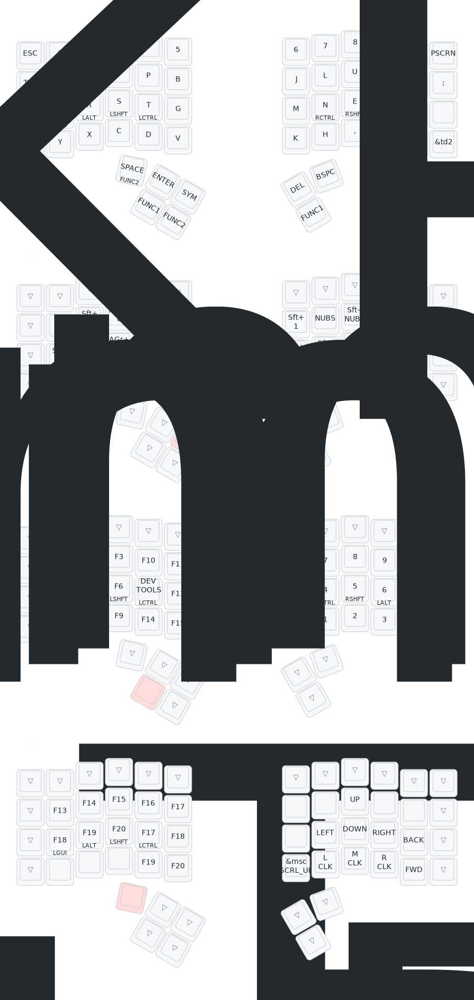

# Charybdis ZMK Firmware

> [!WARNING]
> This is a working keymap for this AliExpress Charybdis keyboard: https://a.aliexpress.com/_Ev6kgX8
>
> I would not recommend buying it from AliExpress because it doesn't support the original creator: [bastardkb](https://bastardkb.com/charybdis/).
>
> The AliExpress seller offers little to no support and you are pretty much on your own.

> [!CAUTION]
> This fork is what works for me. Use at your own risk!

## Keymaps & Layers

## Credits

- [nophramel](https://github.com/nophramel)
- [zmk](https://github.com/zmkfirmware/zmk)
- [eigatech](https://github.com/eigatech)
- [badjeff](https://github.com/badjeff)
- [inorichi](https://github.com/inorichi)
- [manna-harbour](https://github.com/manna-harbour)
- [nickcoutsos](https://github.com/nickcoutsos/keymap-editor)
- [Petejohanson](https://github.com/petejohanson)
- [caksoylar](https://github.com/caksoylar/keymap-drawer)
